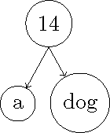
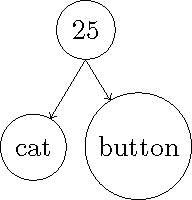
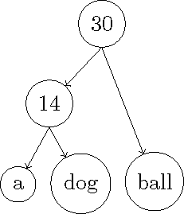
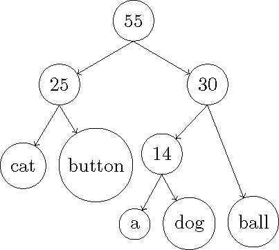
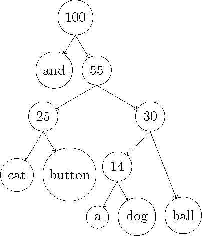
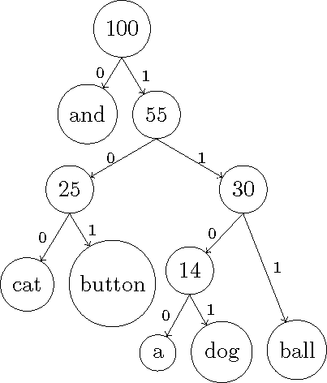

# CS 214: Systems Programming Assignment 2: File Compression

> Warning: As you will see below, the descriptions of the assignments will be increasingly complex because we are asking you to build increasingly bigger programs. Make sure to read the assignment carefully!

## Abstract

The `opendir()` and `readdir()` functions allow you to programmatically traverse through the file system and find/open any file in it (that you have permission to access). File descriptors and `open()` allow you to read from any file and create file at any point (that you have permission to access). This is quite a bit of power and capability for the very small and direct syntax that is required. The file descriptor abstraction is so generic that once you master its use, you have mastered nearly all basic IO you can do in C. You'll exercise your file manipulation capabilities to first generate Huffman codes for a series of files and then to compress and decompress files with a given Huffman codebook.

## Introduction

In this assignment you will practice using the file system API and building different data structures to support an algorithm. In particular, you will be creating, opening, reading, and writing files and building and traversing various trees and lists. Your task is to write a program that will, based on a command-line switch, either: descend through a directory structure, compute a Huffman code across all files it finds and write out that codebook as a file, or apply a Huffman codebook to a file (or all files it finds), compressing them, or use a Huffman code book to decompress a file (or all files it finds).

### Huffman codes

Huffman codes are a fairly quick way to build a lossless code for data that avoids the prefix problem of dynamically-sized codes, namely that of ambiguity. If you have the tokens, `'a'`, `'b'`, `'c'`, `'d'` and assign them the codes `0`, `1`, `01` and `11`, respectively, it is unclear if the code sequence `"11"` means `"bb"` or `"d"`.

In order to build a Huffman code, you first must count the rate of occurrence of all tokens, sort them, build a Binary Tree out of them, with each token as a leaf. Then traverse the Binary Tree built, recording a `'0'` for each left branch, `'1'` for each right branch, assigning the bit sequence generated to each token as a code value. For instance, to build the codebook below:

|  Word  | Frequency | Bit Encoding |
| :----: | :-------: | :----------: |
|   a    |     5     |    `1100`    |
|  dog   |     9     |    `1101`    |
|  cat   |    12     |    `100`     |
| button |    13     |    `101`     |
|  ball  |    16     |    `111`     |
|  and   |    45     |     `0`      |

#### Tree 0

-   Minheap

    |  Word  | Frequency |
    | :----: | :-------: |
    |   a    |     5     |
    |  dog   |     9     |
    |  cat   |    12     |
    | button |    13     |
    |  ball  |    16     |
    |  and   |    45     |

-   Take top 2

    | Word | Frequency |
    | :--: | :-------: |
    |  a   |     5     |
    | dog  |     9     |

-   Build `tree0`

    

-   Insert node for `tree0`

    |  Word   | Frequency |
    | :-----: | :-------: |
    |   cat   |    12     |
    | button  |    13     |
    | `tree0` |    14     |
    |  ball   |    16     |
    |   and   |    45     |

#### Tree 1

-   Minheap

    |  Word   | Frequency |
    | :-----: | :-------: |
    |   cat   |    12     |
    | button  |    13     |
    | `tree0` |    14     |
    |  ball   |    16     |
    |   and   |    45     |

-   Take top 2

    |  Word  | Frequency |
    | :----: | :-------: |
    |  cat   |    12     |
    | button |    13     |

-   Build `tree1`

    

-   Insert node for `tree1`

    |  Word   | Frequency |
    | :-----: | :-------: |
    | `tree0` |    14     |
    |  ball   |    16     |
    | `tree1` |    25     |
    |   and   |    45     |

#### Tree 2

-   Minheap

    |  Word   | Frequency |
    | :-----: | :-------: |
    | `tree0` |    14     |
    |  ball   |    16     |
    | `tree1` |    25     |
    |   and   |    45     |

-   Take top 2

    |  Word   | Frequency |
    | :-----: | :-------: |
    | `tree0` |    14     |
    |  ball   |    16     |

-   Build tree2

    

-   Insert node for tree 2

    |  Word   | Frequency |
    | :-----: | :-------: |
    | `tree1` |    25     |
    | `tree2` |    28     |
    |   and   |    45     |

#### Tree 3

-   Minheap

    |  Word   | Frequency |
    | :-----: | :-------: |
    | `tree1` |    25     |
    | `tree2` |    28     |
    |   and   |    45     |

-   Take top 2

    |  Word   | Frequency |
    | :-----: | :-------: |
    | `tree1` |    25     |
    | `tree2` |    28     |

-   Build tree3

    

-   Insert node for tree 3

    |  Word   | Frequency |
    | :-----: | :-------: |
    |   and   |    45     |
    | `tree3` |    53     |

#### Tree 4

-   Minheap

    |  Word   | Frequency |
    | :-----: | :-------: |
    |   and   |    45     |
    | `tree3` |    53     |

-   Take top 2

    |  Word   | Frequency |
    | :-----: | :-------: |
    |   and   |    45     |
    | `tree3` |    53     |

-   Build tree4

    

#### Final tree

Label each link with `'0'` for left and `'1'` for right



Traverse the tree, recording bit sequence to reach each token:

| Bit Sequence |  Word  |
| :----------: | :----: |
|     `0`      |  and   |
|     100      |  cat   |
|    `101`     | button |
|     1100     |   a    |
|    `1101`    |  dog   |
|    `111`     |  ball  |

Replace all occurrences of tokens with bit sequences from the codebook

-   `Test.txt` contents

    ```
    a dog and cat
    ```

-   `Test.txt.hcz` contents

    ```
    110011010100
    ```

Building a Huffman code will give you a lossless, dynamic-length code with no ambiguity. The code is not informationally optimal, but is optimal in prefix length as it will bias the shorter codes to be used by the tokens that appear most often. Informationally optimal codes can be built with a somewhat more complex algorithm we won't be covering.

## Implementation

### Command Line Interface

Your program must implement the following command-line interface:

```
./fileCompressor <flag> <path or file> |codebook|
```

Your program must support the following flags: (which may appear in any order, but before any arguments)

| Flag | Meaning        | Explanation                                                                                                                                                                                                                                                                                     |
| ---- | -------------- | ----------------------------------------------------------------------------------------------------------------------------------------------------------------------------------------------------------------------------------------------------------------------------------------------- |
| `b`  | Build codebook | The `fileCompressor` will index the file indicated and output a `'HuffmanCodebook'` file in the same directory the `fileCompressor` is invoked in                                                                                                                                               |
| `c`  | Compress       | The `fileCompressor` will compress the file indicated, `<filename>`, using the given codebook in to `<filename>.hcz` alongside the original file                                                                                                                                                |
| `d`  | Decompress     | The `fileCompressor` will decompress the file indicated, `<filename>.hcz`, using the given codebook in to `<filename>` alongside the original file                                                                                                                                              |
| `R`  | Recursive      | Including a `'R'` argument with any of the above will run them in recursive mode, in which case the file argument will need to be a path and `fileCompressor` will recursively descend in to that directory and all subdirectories, recursively applying the given operation to all files found |

#### Examples

```
./fileCompressor -R -b ./
```

Recursively index all files found in the current working directory, all
subdirectories and emit a single `./HuffmanCodebook` for them

```
./fileCompressor -d ./dir/test/file.txt.hcz ./HuffmanCodebook
```

Decompress `./dir/test/file.txt.hcz` in to `./dir/test/file.txt` using the
codebook `./HuffmanCodebook`

### `HuffmanCodebook` format

When building the `HuffmanCodebook`, it should be in the following format:

```
|escape char|
<ASCII bytestring>
<tab>
<token> <newline>
...
<blank line - newline terminated>
```

e.g.:

```
\
0       and
100     cat
101     button
1100    a
1101    dog
111     ball
<blank line - newline terminated>
```

### Tokenizing

Tokens are defined as any sequence of chars terminated by either a whitespace or newline or other control code.

Example: If a file contains

```
This an$example12 mail@rutgers
```

It should tokenize to:

```
This
an$example12
mail@rutgers
```

In order to make code creation and token representation simpler computationally, you should represent all your delimiters as distinct tokens. So, if you are parsing a file and find that it has spaces, tabs and newlines, you should insert representations of tab, space and newline in to your table and compute codes for them as well. This will certainly increase average code length and might cause your 'compressed' version to not be smaller than your plain text, however it will make detection, compression and decompression more straightforward. Be careful to escape control codes as you write them to your codebook. If you write `'\n'` to a codebook, you will get a new line. If you write `'\t'` you will get a tab, not the chars `'\'` and `'t'`, which can be confusing or ambiguous. There are multiple ways to escape control codes, so you write a representation of the code, and not the code itself. If you want to pick an escape character of your own, feel free to use the first line of your codebook to hold it. If you use a different method and do not need to select a unique escape char, you do not need to use the first line for an escape character.

## Methodology

You may want to first code a min-heap and binary tree. If you are going to build a binary tree, it isn't too much farther to build a binary search tree, which will allow you to quickly sort tokens in to your tree (it is not too many steps to convert a BST in to an AVL tree as well, for guaranteed `O(lg(n))` inserts). This can be done in isolation from any other code

You may want to approach building up your functionality in the following manner

1. Get your program to find all files in a directory and print out their names
2. Get your program to recursively descend all subdirectories and print out their names with paths

    - Open all files and output them to `stdout` to test
    - Open all files and write them to `<filename>.test` to test

3. Build and test tokenizing static strings in your code

    - Count the number of occurrences of each token read in from files

4. Generate a Huffman codebook given a sequence of tokens and frequencies
5. Implement the `-b` and `-R` flags and test writing out a Huffman code book
6. ... etc.

## Results

Submit a tarred gzipped file named `Asst2.tgz` that contains:

-   A directory named `Asst2/` that contains the following:

    -   All `.h` and `.c` files necessary to produce an executable named `fileCompressor`

    -   `Makefile` used to build the `fileCompressor` executable

        Make sure it has an `all` target as its first directive, as well as a `clean` target

    -   `testplan.txt` that details the testing you ran your program through
    -   `readme.pdf` that describes the design and implementation of your `fileCompressor`

        Include an analysis of the time and space usage and complexity of your program. You do not need to analyze every size function, but you should analyze the overall program's time and space used as a function of the size of the input.

Your grade will be based on:

|    Criteria    |                Explanation                 |
| :------------: | :----------------------------------------: |
|  Correctness   |        How will your code operates         |
| Design Quality |          How well your code works          |
|  Code Quality  | How well written and readable your code is |
|   Efficiency   |      Asymptotically in time and space      |
|    Testing     |        How thorough your cases are         |

Grouping:

-   Unless explicitly exempted, you must have a partner, if you do not you will incur a 20pt penalty.
-   Be sure to sign up on the Google sheet for this assignment, even if you did last time. If you do not, you will not receive a grade.

`f`-commands:

-   Do not use `fopen`, `fread`, `fwrite`, or any of their ilk.

    (Don't think it, don't code it ... don't think it, don't code it... don't think it, don't code it)
